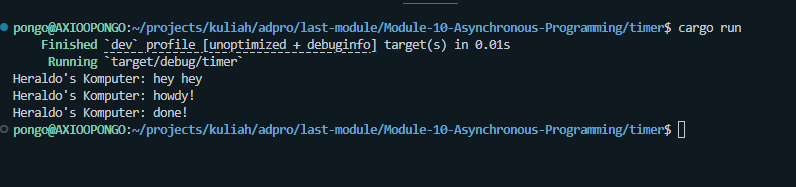
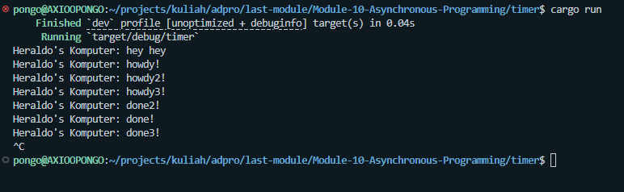
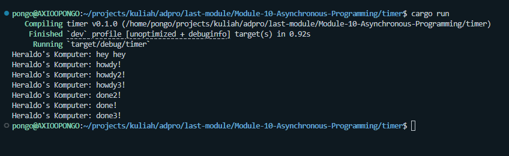
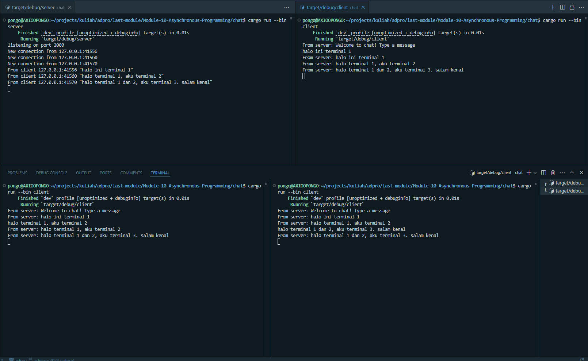
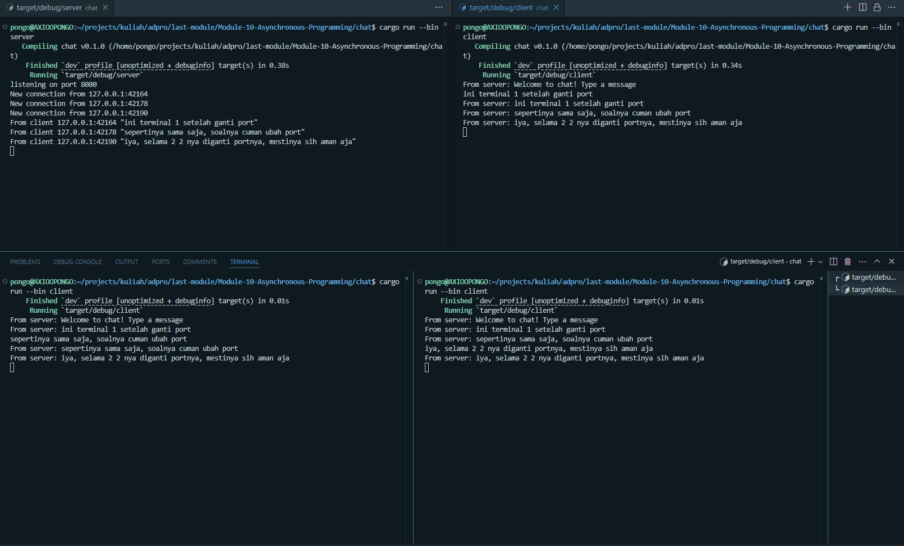
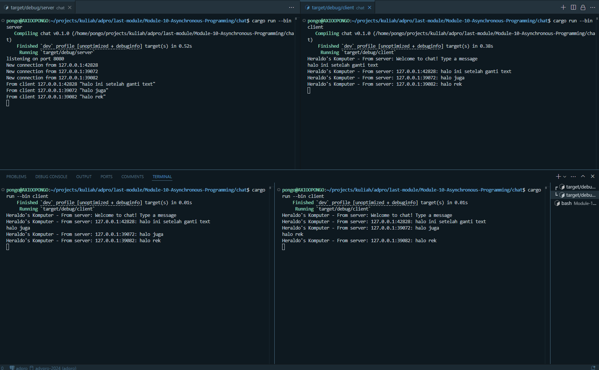
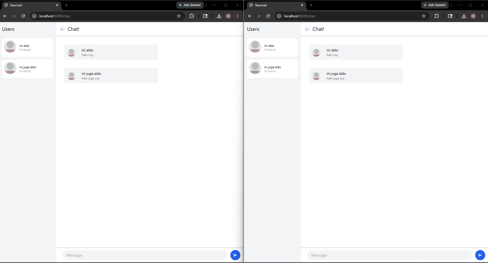

# Module 10 - Asynchronous Programming

## Experiment 1.2: Understanding how it works

**Penjelasan:**
Pada eksperimen ini, pesan `Heraldo's Komputer: hey hey` tercetak lebih dulu dibandingkan `howdy!` dan `done!`. 

Hal ini terjadi karena pemanggilan fungsi `spawner.spawn(...)` tidak langsung mengeksekusi *future* yang diberikan pada saat itu juga, melainkan hanya memasukkan *task* tersebut ke dalam antrean (task queue) dari *executor*. Setelah *task* dimasukkan ke antrean, alur program pada fungsi `main` (yang bersifat *synchronous*) terus berjalan ke baris selanjutnya, sehingga ia langsung mengeksekusi perintah `println!("Heraldo's Komputer: hey hey");`.

Barulah ketika baris terakhir `executor.run()` dieksekusi, *executor* akan memproses antrean *task* yang ada, menjalankan *future* yang tadi sudah di-*spawn* (mencetak `howdy!`), menunggu *timer* selama 2 detik, lalu mencetak `done!`.

## Experiment 1.3: Multiple Spawn and removing drop

**Penjelasan:**
* **Multiple Spawn:** Ketika kita melakukan beberapa `spawn`, *tasks* tersebut tidak dijalankan secara berurutan (*sequential*), melainkan secara *concurrent* (bersamaan). Ini terlihat dari semua tulisan `howdy` yang muncul di awal, lalu *timer* 2 detik berjalan bersamaan untuk semua *task*, dan akhirnya semua pesan `done` tercetak hampir di waktu yang sama.
* **Fungsi Spawner:** Bertugas untuk membuat *task* baru (membungkus *future*) dan mengirimkannya ke dalam antrean (*channel* / *queue*) agar nanti bisa dieksekusi.
* **Fungsi Executor:** Bertugas untuk mengambil *task* dari antrean (*ready queue*) dan menjalankannya (memanggil `poll` pada *future* tersebut) hingga selesai.
* **Fungsi Drop(spawner):** Ini adalah kunci kenapa program bisa berhenti. `drop(spawner)` akan menutup interaksi *sender* pada *channel*. Jika *spawner* tidak di-*drop*, *executor* akan terus menyala (menunggu dengan asumsi masih ada *task* yang akan dikirim dari *spawner* lain), sehingga program menjadi *hang* dan tidak mau selesai.

## Experiment 2.1: Original code of broadcast chat

**Cara menjalankan:**
1. Buka satu terminal dan jalankan `cargo run --bin server` untuk menyalakan WebSocket server di port 2000.
2. Buka beberapa terminal lain (misalnya 3 terminal) dan jalankan `cargo run --bin client` di masing-masing terminal.

**Apa yang terjadi saat mengetik teks:**
Ketika sebuah teks diketik di salah satu *client* lalu dikirim (Enter), *client* tersebut akan mengirimkan pesan melalui *websocket connection* ke *server*. *Server* yang bertugas me-*manage* seluruh koneksi akan menerima pesan tersebut, lalu melakukan *broadcast* (mengirim ulang) pesan itu ke seluruh *client* lain yang sedang terhubung ke *server*. Alhasil, *client* lain akan menerima dan menampilkan pesan tersebut secara *real-time* berkat sifat sistem *asynchronous* yang tidak memblokir antrean koneksi.

## Experiment 2.2: Modifying the websocket port

**Penjelasan:**
Untuk mengubah *port* koneksi *websocket* menjadi `8080`, ada dua file yang harus dimodifikasi:
1. **`src/bin/server.rs`**: Mengubah argumen pada `TcpListener::bind("127.0.0.1:8080")` agar server mendengarkan (*listen*) koneksi masuk pada port `8080`.
2. **`src/bin/client.rs`**: Mengubah alamat URI tujuan pada `ClientBuilder::from_uri(Uri::from_static("ws://127.0.0.1:8080"))` agar *client* mencoba terhubung ke port yang benar.

Protokol yang digunakan tetap sama, yaitu *websocket* (ditandai dengan awalan `ws://` pada URI di file *client*). Kedua belah pihak harus menggunakan port yang sama agar *handshake* dan komunikasi TCP dapat terjalin.

## Experiment 2.3: Small changes. Add some information to client

**Penjelasan Modifikasi:**
Untuk menampilkan IP dan Port pengirim pada setiap *client*, saya melakukan modifikasi di sisi server. Pada fungsi `handle_connection` di `server.rs`, setiap kali server menerima pesan berupa teks dari *client*, server akan memformat ulang pesan tersebut dengan menambahkan variabel `addr` (bertipe `SocketAddr` yang berisi IP dan Port). Pesan yang sudah diformat (`"{addr}: {text}"`) inilah yang kemudian di-*broadcast* ke *channel*.

Selain itu, di sisi `client.rs`, saya mengubah format `println!` pada saat menerima pesan dari server untuk menyertakan teks `Heraldo's Komputer -`.

## Experiment 3.1: Original code

**Penjelasan:**
Pada eksperimen ini, saya mengunduh proyek YewChat (berbasis Rust WebAssembly) dan SimpleWebsocketServer (berbasis Node.js). 
Server Node.js berjalan di latar belakang untuk menangani koneksi websocket pada port `8080`. Di sisi klien, *framework* Yew me-*render* antarmuka UI ke dalam bentuk HTML dan berkomunikasi dengan server melalui protokol *websocket*. Klien berjalan di browser, dan ketika *user* mengetikkan pesan, pesan tersebut diteruskan ke *server* lalu di-*broadcast* ke semua klien yang terhubung sehingga antarmuka *chat* di-*update* secara *real-time*.